# Just-Like-Clockwork

A Lap Timer to record what work is done hourly, and export a report for the same, so I can charge an hourly work rate for Freelancing

# Screenshots

## Timer

## Stats

# Features

1. You can split laps if you were working on something for too long and forgot to log it! If this was a mistake, you can merge them too!
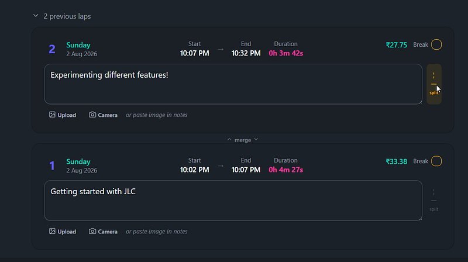
2. You can paste screenshots right in the lap of your work from your clipboard, or upload them! You can even use your camera if you are feeling lucky!
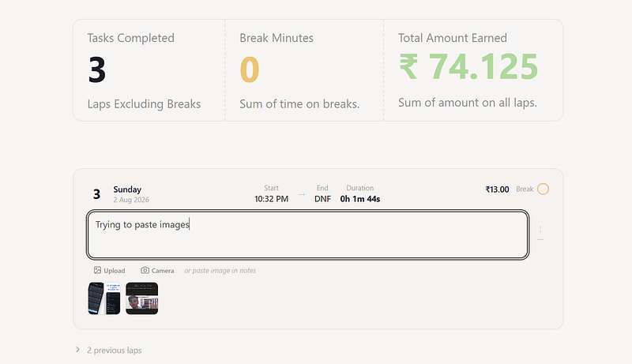
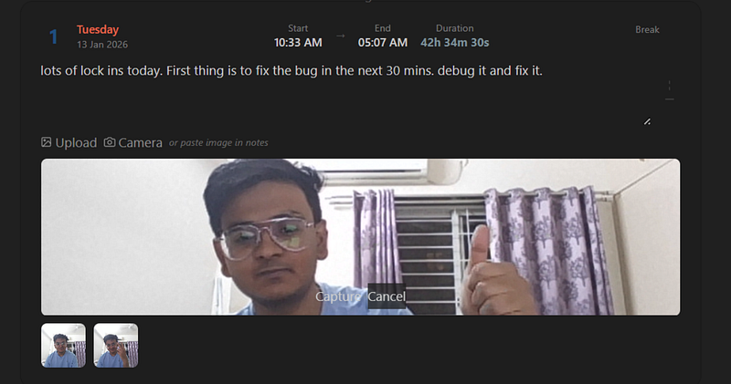
3. You can save sessions in your browsers Localstorage. I am planning to have a backend for this for storing it more permanently. 
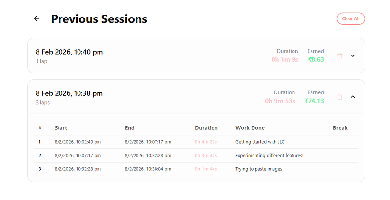
4. You can export to CSV, json, pdf. 
5. You can use all of Daisy UI Themes!
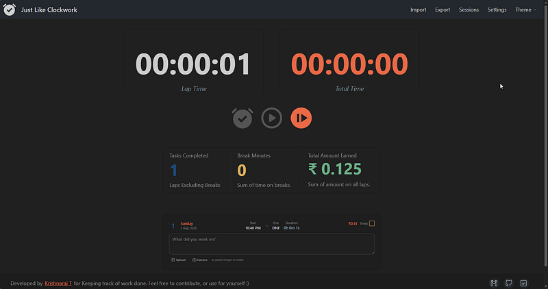
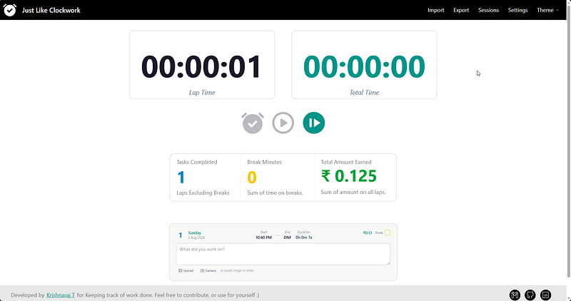

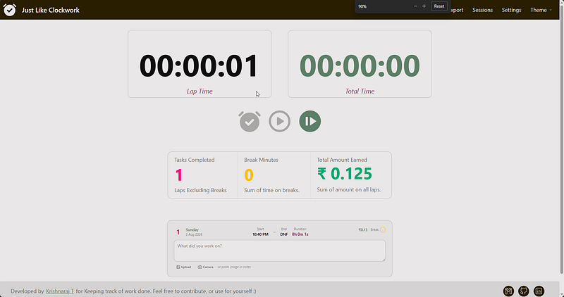

6. You can hide your earnings as well, have a minimalistic home page if you wanna hide your previous laps as well!
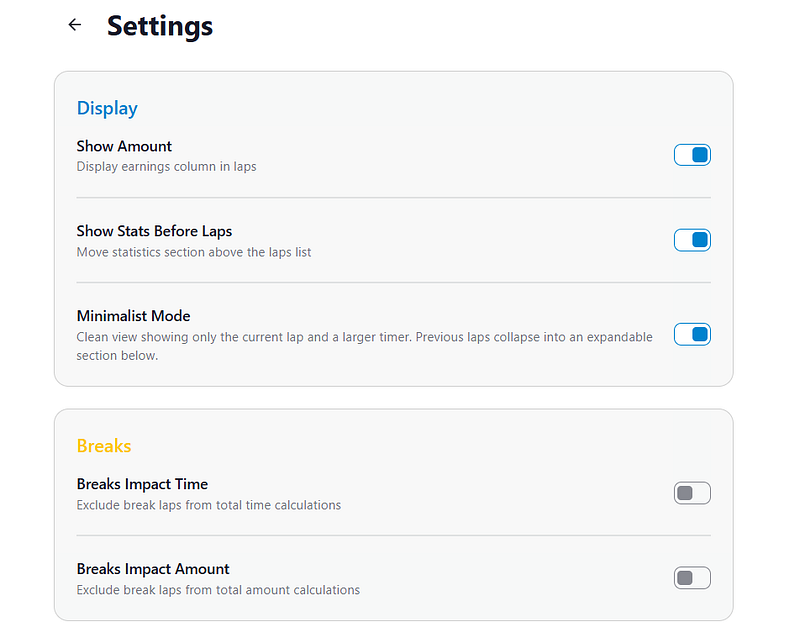
7. You can add breaks, which may or may not affect your total count. 
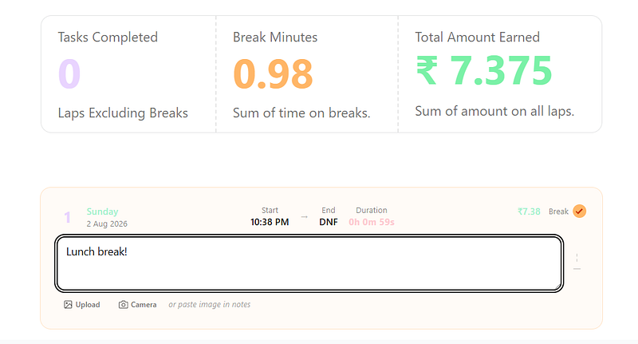
8. You can export selectively, only the columns you want. 
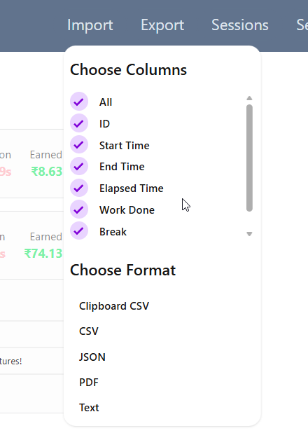
9. You can import from a prior JSON or CSV as well if you believe some manual correction is required.
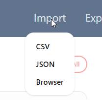
# To Do

- Add Backend for this to store sessions more permanently, and to sync across devices.
- Add a Pomodoro timer mode, which will have a work and break timer, and will automatically switch between them.
- Add a feature to track time spent on different projects, and generate reports based on that.

# Made with:

- React
- Tailwind CSS
- React Router
- Tabler Icons
- Daisy UI

I had a lot of fun making this. In fact I stopped doing the actual work which I was supposed to do for making this instead. I had made this a while back, and have been using it for a long time now at work to track the things done throughout the day. I then usually export the csv and paste it on Notion to track it.

So special thanks to all of these projects that made this one possible. I hope you have fun using this!
